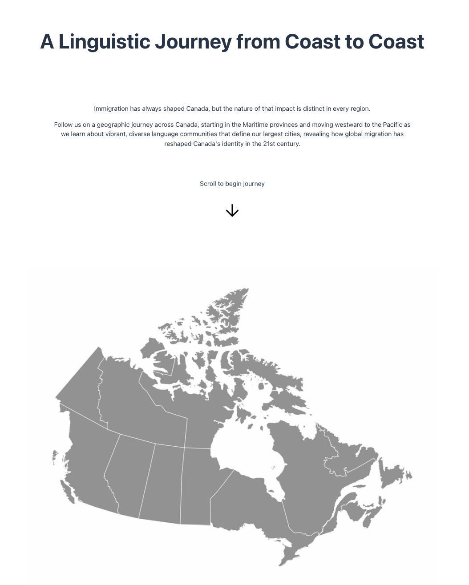
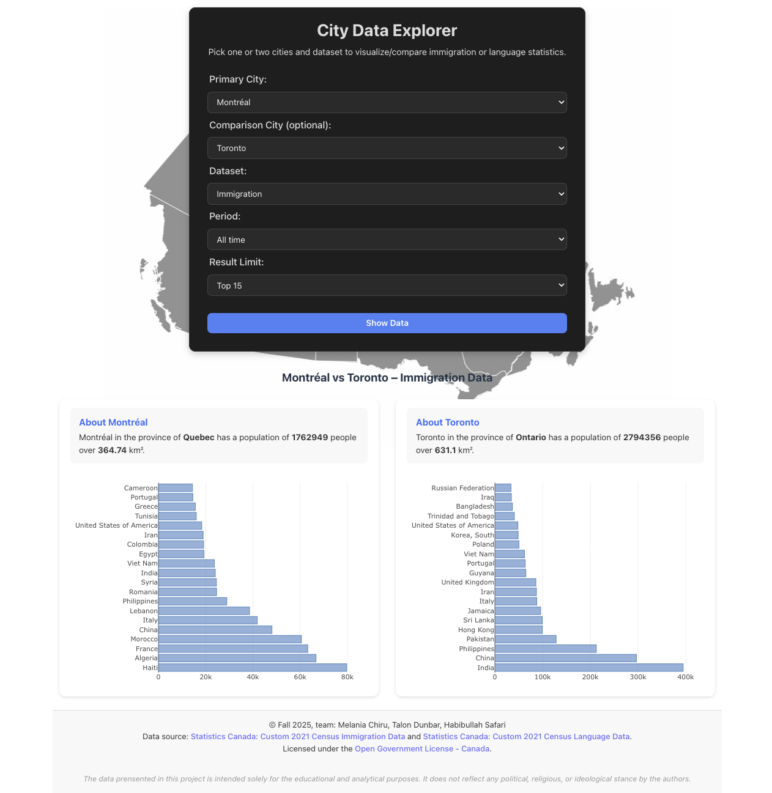

# Immigration Patterns in Canadian Cities and Languages Spoken in Those Cities

## Project Overview

This project aims to explore and visualize Canadian immigration patterns to different major cities through the lens of the languages spoken. 
By combining demographic and linguistic datasets, we will create a narrative that illustrates how different immigrant communities cluster in major Canadian cities, showcasing the cultural and linguistic profile of each major city center.

## Selected cities 

| Region              | Cities           |
| ------------------- | ---------------- |
| Atlantic/East       | Halifax          |
| Central/Francophone | Montreal         |
| Central/Anglophone  | Toronto          |
| Prairies            | Calgary/Edmonton |
| Pacific/West        | Vancouver        |

## Screenshots

Below are previews of the project interface showing the landing (Hero) section and the interactive Data Explorer.

### Hero Section



### Data Explorer



## Setup Instructions

### Prerequisites
- **Node.js**
- **npm**
- **MongoDB Atlas account** or a local MongoDB instance

---

### 1. Clone the Repository

```bash
git clone https://gitlab.com/dawson-cst-cohort-2026/520/section3/teams/teamhabibmelaniatalon/520-project-safari-chiru-dunbar.git
cd 520-project-safari-chiru-dunbar
```
---

### 2. Install Dependencies

From the project root:

```bash
npm install
```

---

### 3. Configure Environment Variables

Copy the example environment file and fill in your credentials:

```bash
cp .env.example server/.env
```

Edit `.env` to include your MongoDB database name and connection string.
Copy the complete `.env` into the directory with the database seeding script:

```bash
cp server/.env server/db/utils/.env
```

---

### 4. Seed the database

Seed your MongoDB database with the project data:

```bash
node server/db/utils/seed.mjs
```

---

### 5. Build the project

From the root directory, build the frontend for production:

```bash
npm run build
```

---

### 6. Start the Production Server

```bash
npm run start
```

The server will start on http://localhost:3000/index.html

---

### 7. Optional: Development Mode

If you’d like to run the backend and frontend separately during development:

```bash
# In one terminal (backend)
cd server
npm run dev

# In another terminal (frontend)
cd client
npm run dev
```

The frontend (Vite) will run on http://localhost:5173, and the backend API on http://localhost:3000.

## Attributions

### Dataset Sources

- **Custom 2021 Census Immigration Data**: [Statistics Canada](https://www150.statcan.gc.ca/t1/tbl1/en/cv!recreate.action?pid=9810034901&selectedNodeIds=1D12,1D37,1D100,1D123,1D126,1D166,4D1&checkedLevels=1D1,2D1,4D5,5D1,5D2&refPeriods=20210101,20210101&dimensionLayouts=layout3,layout3,layout3,layout3,layout3,layout3,layout2&vectorDisplay=false) - [Licensed under the Open Government Licence – Canada.](https://open.canada.ca/en/open-government-licence-canada)
- **Custom 2021 Census Language Data**: [Statistics Canada](https://www150.statcan.gc.ca/t1/tbl1/en/cv!recreate.action?pid=9810019201&selectedNodeIds=4D4,4D5,4D7,4D115,4D127,4D145,4D149,4D159,4D177,4D178,4D184,4D187,4D197,4D203,4D214,4D218,4D219,4D220,4D229,4D233,4D242,4D243,4D248,4D249,4D250,4D251,4D255&checkedLevels=0D3,0D4,1D1,2D1,4D1&refPeriods=20210101,20210101&dimensionLayouts=layout3,layout3,layout3,layout3,layout3,layout2&vectorDisplay=false) - [Licensed under the Open Government Licence – Canada.](https://open.canada.ca/en/open-government-licence-canada)

### Visual Asset Sources

- **Canada SVG Icon**: [svgrepo.com](https://www.svgrepo.com/svg/406564/maple-leaf)
- **Map of Canada Image**: [fla-shop.com/svg/canada](https://www.fla-shop.com/svg/canada/)

### External Libraries

#### Client (Frontend)

- **Data Visualization**: [plotly.js/react-plotly.js](https://www.npmjs.com/package/react-plotly.js/v/2.2.0)
- **Lazy Loading**: [react-intersection-observer](https://www.npmjs.com/package/react-intersection-observer)

#### Server (Backend)

- **CSV Parsing**: [csv-parse](https://www.npmjs.com/package/csv-parse)

### Code Reference Sources

- **Dependency Injection Reference**: [Stack Overflow](https://stackoverflow.com/questions/75843342/typeerror-es-modules-cannot-be-stubbed-sinon)
- **Execution Guarding Reference**: [Stack Overflow](https://stackoverflow.com/questions/57838022/detect-whether-es-module-is-run-from-command-line-in-node)
- **CI Rules**: Jaya’s Assignment 2 repository
- **ESLint Rules**: Jaya’s Assignment 2 repository
- **Database Class**: Jaya’s Exercise 8.2 solution code

### AI Assistance

- **ChatGPT - Assisted with**:
  - Regex pattern creation.
  - Refining CSS styling.
  - Initial creation of Swagger JSDoc comments *(all information double checked/manually refined)*.
  - Polishing up text presented to users *(all information given was double checked)*.